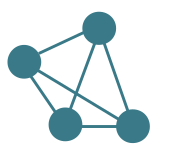
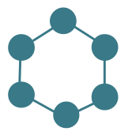
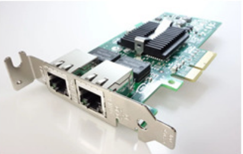
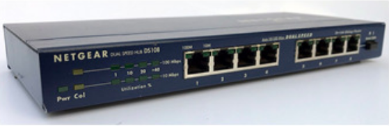
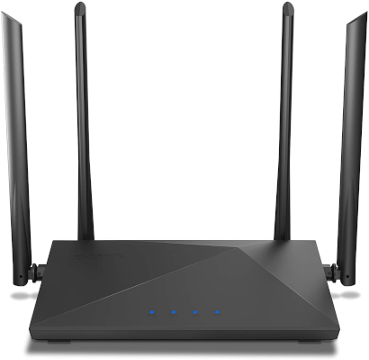
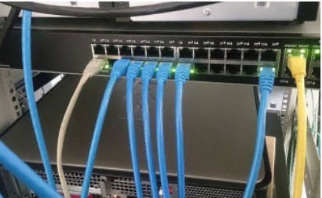

# Notas da Aula:

## Classificação de Redes Tecnologica

### Redes de Broadcast
- Tipo de Rede Dinâmica;
- Mensagens enviadas e recebidas por todos os nós da rede (Apenas o destinatário poderá abrir o conteúdo);
- **Exemplos:**
	- Redes Locais (LANs);
	- Redes em Anel;
	- Arvore;
	- Satelete
	- Redes em Barra.

### Redes Ponto a Pronto
- Vários destinos para chegar em um local;
- **Exemplos:**
	- WLANs;
	- Ligações Discadas.

## Classificação de Redes em Escala:

### Redes Locais (LAN)
- Privada a um local com até alguns quilomêtros de extençãoç
- **Velocidade:** de 10 Mbits/s a 1000 GIGAbits/s;
- **Padrão:** Ethernet IEEE 802.3.

### Redes Metropolitanas (MAN)
- Restrita a uma área de até 10 km.

### Wide Area Network (WAN)
- Paises ou continentes;
- Conectado a sub-redes, mantidos por provedores;
- Comutação por pacotes.

### Redes sem Fio
- Interconexão de Sistemas (WPAN);
- LANs sem fio (WLAN);
	- IEEE 802.3 wifi.
- WAN sem fios (WWAN).

## Topologia de Redes

| Malha | Anel | Estrela | Barramento (Ponta a Ponta)
|:----------:|:----------:|:----------:|:----------:|
|  |   |  | 

## Hardwares de Rede

| Placa de Rede | Modem | Hub | Roteador | Switch
|:----------:|:----------:|:----------:|:----------:|:----------:|
|  |   |  |  | 

## Modelo OSI
Padronização dos esquemas de rede. Divide a rede em camadas fazendo com que cada uma exerça uma tarefa específica.

|  -  |   Camadas 		|  Descrição
|:-:|:------:|:----------------------------:|
| 7º | Aplicação  	| Requisições HTTP.
| 6º | Apresentação | Compressão de dados para envio (encriptação e codificação).
| 5º | Sessão		| Conexão entre máquinas distintas, gerando assim uma sessão.
| 4º | Transporte	| Fragmenta os dados recebidos da camada de sessão (5º).
| 3º | Rede		| Controla a aperação de sub-rede controlando como os pacotes são roteados da origem até o seu destino. Controla e previne o congestionamento.
| 2º | Enlace		| Organizar acesso ao meio fisico, corrigindo erros.
| 1º | Fisica 		| Transmissão de bits brutos por um canal de comunicação, como representar 0 e 1.

## Modelo TCP/IP
Arquitetura de rede usada atuamente e que leva o modelo de OSI consigo.

|   Dado  |  Camadas  |  Protocolos
|:----------:|:---:|:---------------:|
| Mensagem | 4º Aplicação  	 	| FTP, SMTP, DNS, HTTP, TELNET.
| Segmento TCP e Datagrama UDP | 3º Transporte	 	| TCP, UDP.
| Diagrama IP | 2º Internet/Rede   | IP, ICMP.
| Quadro | 1º Interface de Rede | Ethernet, Token Ring.

## Camada de Transporte (Protocolos)

TCP 		|  UDP
|:-----------------------------:|:-------------------------------:|
| Serviço orientado à conexão | Serviço sem conexão
| Garante a entrega por meio da confirmação de recebimento, pois os dados são sequenciados. | Não garante o recebimento, pois os dados não são sequenciados.
| O programa que utiliza o TCP possui um transporte confiável. | A garantia de recebimento do software que utiliza o protocolo UDP deve ser garantida pelo programa.
| Transmissão lenta e necessita de maior largura de banda.	| Transmissão rápida e ocupa menos largura de banda.
| Comunicação ponto a ponto. | Suporte a comunicação multicast.

# Exercícios:

**Questão 01**. Forouzan (2006) define que (a)(o)s ________________são hardwares de redes que contêm microprocessadores, responsáveis pelo gerenciamento dos tráfegos de pacotes de dados e ele tem a capacidade de analisar o endereçamento lógico (TCP/IP).

**R: Roteadores**

**Questão 02**. O protocolo de correio eletrônico SMTP:

a) transfere correspondência do servidor de correio remetente para o servidor de correio destinatário.

b) tem comandos que permitem que um agente de usuário obtenha componentes da mensagem.

c) trabalha com recepção das mensagens de e-mail, evitando a necessidade de baixá-las antecipadamente para o computador do usuário.

d) provê comandos para que os usuários possam pesquisar em pastas remotas.

e) usa a porta 110 TCP.

**R: A**

**Questão 03**. O que é TCP/IP?

a) É um endereçamento para configurar a rede para 2 ou mais computadores não se comunicarem.

b) É um protocolo apenas de recebimento de dados, exclusivamente por rede Física.

c) É um protocolo apenas de envio de dados, exclusivamente por rede Wireless.

d) É um protocolo para envio e recebimento de dados, apenas utilizado pela Wireless.

e) É um conjunto de protocolos, isto é, de padrões de comunicação que são responsáveis por execuções de tarefas distintas, a fim de realizar a comunicação de dois ou mais computadores.

**R: A**