# Notas da Aula:

## Protocolo IPv4
- É endereço lógico feito para que um dispositivo possa se comunicar com qualquer outro dispositivo, em qualquer lugar do mundo;
- Possui 32 bits, sendo possível produzir 4,3 bilhoes de endereços (2³²);
- Esta definido na camada de rede, sendo o seu pacote denominado datagrama.

### Datagrama:

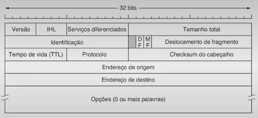

- A anotação de um endereço IP é separada por ponto dazendo com que uma parte identifique a rede e a outra, o dispositivo (Host);
- **Exemplo:** _172.16._**30.110**
	- 172.16 => Identifica à qual rede o dispositivo pertence;
	- 30.110 => Determina o endereço do dispositivo.

## Classes de Endereço
Os endereços utilizados nas redes foram divididos em classes para utilização de acordo com o número de dispositivos da rede.

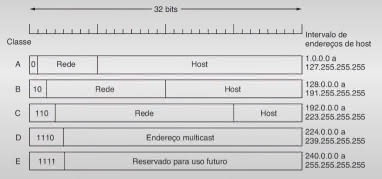

## Sub-rede
Quando um pacote entra no roteador principal de uma rede classe B (por exemplo), como este sabe qual sub-rede (Ethernet) deve entregar o pacote?

- Tabela com 65.536 entradas? NÃO!;
- Alguns bits são retirados do número de host para criar um número de sub-red;
- Roteador precisa de uma máscara de sub-rede.

- Permite que uma rede seja dividida em diversas partes para uso interno, mas externamente continua a funcionar como uma única rede.
- **Vantagens:**
	- Redução do tráfego de rede;
	- Simplificação no gerenciamento da rede;
	- Controle dos recursos da rede.

### Exemplo

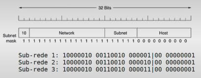

### Cálculo de sub-rede e máscara de sub-rede
- Rede de classe C: 192.168.0.0
- Máscara padrão: 255.255.255.0
- 255.255.255.0 → 11111111.11111111.11111111.00000000
- Rede: 2n = 22 = 4 ,
- Hosts por sub-rede: 2n = 26 64
- Nova máscara: 11111111.11111111.11111111.11000000
- = 255.255.255.192
- Notação CIDR: 192.168.0.3 /26

**Tabela de sub-redes**

Rede  | 1º IP Válido | Último IP Válido | Broadcast
|:---------------:|:---------------:|:---------------:|:---------------:| 
192.168.0.0 | 192.168.0.1 | 192.168.0.62 | 192.168.0.63
192.168.0.64 | 192.168.0.65 | 192.168.0.126 | 192.168.0.127
192.168.0.128 | 192.168.0.129 | 192.168.0.190 | 192.168.0.191
192.168.0.192 | 192.168.0.193 | 192.168.0.254 | 192.168.0.255

192.168.0.66 = 11000000.10101000.00000000.01000010 |
|:---------------:|
**AND** |
255.255.255.192 = 11111111.11111111.11111111.**_11_**000000 |
**ENDEREÇO DE REDE** |
192.168.0.64 = 11000000.10101000.00000000.01000000 |

## Ethernet

O tipo de tecnologia do **cabeamento** dita a velocidade que cada um deles pode atingir:

- Fast Ethernet (802.3u): 100 Mbit/s. 100Base-TX 100Base-T e 100Base-FX;
- Gigabit Ethernet (802.3z): 1 Gigabit/s. 1000BASE-LX, 1000BASE-SX, 1000BASE-CX e 1000BASE-T;
- 10 Gbit/s Ethernet (802.3ae)
- 40/100 Gbit/s Ethernet (802.3)

### Métodos de Transmissão Ethernet

**CSMA/CD (carrier sense multiple access with collision detection)**

Permite que qualquer dispositivo da rede possa efetuar uma transmissão sem hierarquizar quem tem prioridade.
trata-se de um protocolo que faz a transmissão com base na detecção da existência de uma transmissão:

- **CSMA não persistente:** Se o meio estiver ocupado, o dispositivo espera um tempo aleatório;
- **CSMA 1 persistente:** Dispositivo “escuta” a rede até que o meio fique livre;
- **CSMA p-persistente:** Calcula a probabilidade de colisão;

**CD (coilision detection – detecção de colisão)**
Faz com que os nodos existentes na rede “escutem” a rede e possam detectar colisões (técnica conhecida como LTW – listen while talk – escuta enquanto fala).
Quando é detectada uma colisão, o nodo emite um pacote alertando todos os dispositivos.

### Ethernet Comutada

Se basea no dispositivo Switch, assim não há colisão de dados pois cada porta trabalha de forma independente.

As transmissões 802.3 utilizam um cabeçalho de 14 bytes, dos quais:

- 6 bytes: são utilizados para o endereço de origem;
- 6 bytes: são para o endereço de destino;
- 2 bytes: descrevem o número total de bytes a serem transmitidos;
- É constituída em cima de uma topologia estrela.

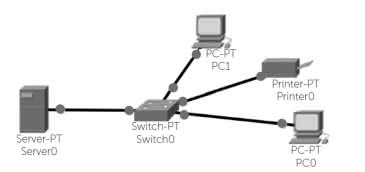

- Obs: Switch como dispositivo central da rede, realizando a função de comutação de pacotes.

## Domínio de broadcast
- No domínio de broadcast, determina-se o limite a que o pacote pode chegar;
- Um dispositivo em uma rede local é capaz de efetuar a comunicação com outro sem que seja utilizado um roteador.

### Domínio de colisão e de broadcast
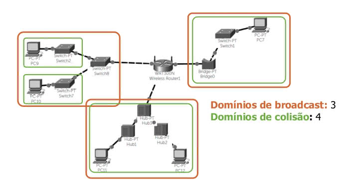

## Protocolo IPv6
- Nova versão do protocolo IPv4;
- Popularização da Internet – esgotamento do protocol IPv4;
- IPv6 teve início em 1990;
- Empresas como Google, Yahoo e Facebook iniciaram a migração para o protocolo IPv6 em 2010;
- Possui 128 bits (340 undecilhões de endereços);
- Oito grupos com quatro dígitos hexadecimais:
	- 8000:0000:0010:0000:0123:4567:89AB
- Resolver a escassez de endereços;
- Simplificar o cabeçalho, facilitando o processamento e o aumento da velocidade do envio/recebimento;
- Tornar opcionais os campos obrigatórios do cabeçalho, facilitando, assim, o roteamento dos pacotes;
- Garantir a segurança das transmissões, tornando o Ipsec obrigatório.

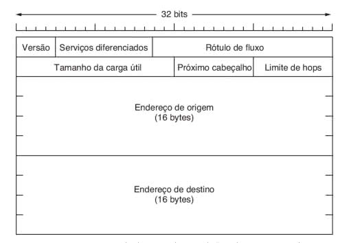

### Tipos de Endereçamento IPv6
**Unicast**

- Identifica uma única interface;
- Global-Unicast, Link-Local (FE80:: /64) e Unique-Local (FC00:: /7).

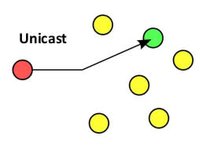

**Anycast**

- Identificam um grupo de interfaces de nós diferentes;
- O pacote alcança a interface mais próxima.

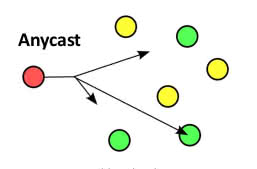

**Multicast**

- Identifica um grupo de interfaces ou grupo de nós;
- O pacote alcança todas as interfaces do grupo.

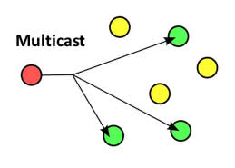

### IPv4 vs IPv6 (Resumo)

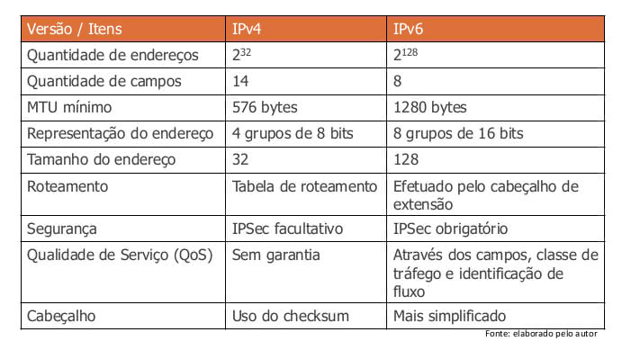

## Técnicas de Transição IPv4 / IPv6

### Pilha Dupla
- Provê o suporte a ambos os protocolos no mesmo dispositivo;
- A mensagem está no formato IPv4 e é encapsulada com IPv6, ou vice-versa.

### Tunelamento (tunneling)
- Determinado pela RFC 2983, fornece orientações técnicas para permitir a utilização de uma infraestrutura IPv4 para encaminhar pacotes IPv6;
- **Possibilidades:** Roteador a roteador, Roteador a host e Host a host.

### Túnel broker
- Este mecanismo foi definido na RFC 3035;
- Pacote IPv6 é encapsulado dentro do pacote IPv4, permitindo o roteamento através do túnel;
- É utilizada em sites IPv4/IPv6 ou em computadores que estejam em uma rede IPv4 e necessitem de interoperabilidade em seus acessos.

### ISATAP (intra-site automatic tunnel addressing protocol)
- Esta técnica foi definida em duas RFCs, sendo elas a 5214 e 4213;
- Com ela é possível utilizar um endereço atribuído pelo DHCPv4 aos dispositivos, possibilitando que o nodo ISATAP determine a entrada e a saída do túnel IPv6.

## Gerência de Redes

### Nível de utilização
- testes de desempenho por meio da injeção de um determinado tráfego na rede.
	- Taxa máxima suportada, Tempo de deslocamento de um pacote, Tempo de recuperação a falhas.

### Perfil de tráfego
- Ao conhecer o perfil do tráfego da rede, é possível adequar os recursos às necessidades, ou ainda manter o equilíbrio necessário para ter um nível de qualidade adequado.

### Vazão (Throughput)
- Quantidade de dados transferidos entre dispositivos em determinado tempo - bits por segundo (bps);
- Taxa de transferência pode ser menor do que a largura de banda, devido a perdas e atrasos.

### Perda de pacotes
- Roteadores não tem capacidade de armazenamento de pacotes infinita (após o esgotamento, os pacotes são descartados).

### Latência (atraso)
- _Tempo de transmissão + Tempo de propagação_;
	- _Tempo de transmissão = Dimensão do pacote (bits) / Velocidade da Transmissão (bps)_.
	- _Tempo de propagação = Dimensão do Canal (Km) / Velocidade de Propagação (Km/s)_.

### Jitter
- Variação no tempo e na sequência de entrega dos pacotes (Packet-Delay Variation) devido à variação da latência (atrasos) na rede.

### Disponibilidade
- Capacidade que equipamentos e redes possuem de forma contínua por um período;
- _D = MTTF / (MTTF +MTTR)_
	- _Tempo médio para falhas (MTFF) e Tempo médio para reparos (MTTR)_

### QoS (Quality of Service)
- Conjunto de regras, mecanismos e tecnologias que tem o propósito de utilizar os recursos disponíveis de forma eficaz e econômica.

## VLAN Trunk Protocol
- Protocolo de camada 2, desenvolvido pela Cisco, para configuração de VLANs, facilitando, assim, a sua administração.

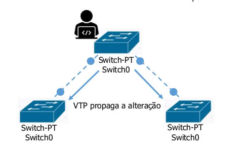

# Para fixar:
01. Crie uma máquina virtual com alguma distro linux ou windows;
02. Configure a máquina vitual `settings => Network => Adapter 01 => Attached to: Bridged Adapter`;
03. Utilize SSH (Secure Socket Shell) para acessar remotamente (Veja o IP da máquina virtual).
	- Caso esteja usando windows Utilizar o programa Putty3;
	- Porta padrão do SSH é 22;
	- Ver IP do Linux `ip addr`
