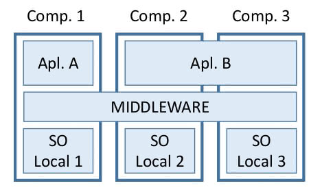
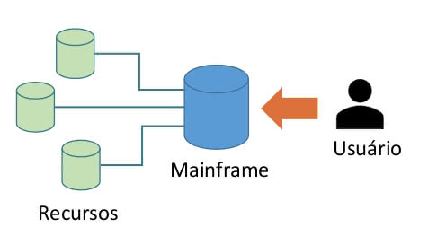
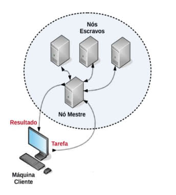

## Sistemas Distribuídos
Um sistema distribuído é um conjunto de computadores interligados via rede, mas, para o usuário final das aplicações, que são executadas através deles, aparenta ser um sistema único.

### Aspectos:
- Funcionamento Independente;
- Hardwares Diversificados;
- Middleware.

### Objetivos:
- Disponibilidade alta e fácil acesso ao sistema e a todos os seus recursos;
- Confiabilidade maior que nos sistemas centralizados;
- Aumento de Desempenho, já que há múltiplas instancias;
- Ocultar ao usuário que os recursos do sistema são distribuídos;
- Deve ser aberto, deve facilitar a inclusão de novas máquinas e recursos.

### Desafios:
- **Heterogeneidade:** Operar em nós com características de hardware diferentes, e suportar diferentes sistemas operacionais;
- **Segurança:** Garantir confidencialidade, integridade e disponibilidade;
- **Tolerância a Falhas:** Capacidade do sistema distribuído se auto recuperar;
- Escalabilidade, concorrência e abertura

## Classificação de Sistemas Distribuídos

### Sistemas Centralizados (Mainframes)

- **Vantagens:** Estabilidade e robustez, segurança, facilidade de gerenciamento e maior segurança de dados;
- **Desvantagens:** Escalabilidade e produtividade, linguagens de programação antigas, tamanho servidor, falta de interface gráfica.

### Sistemas Paralelos

- **Vantagens:** Escalabilidade; produtividade e economia;
- **Desvantagens:** Dificuldade para gerenciamento e segurança;
- **Sistemas Paralelos Fortemente Acoplados:**
	- A comunicação entre processadores ocorre por meio de barramentos internos;
	- Os processadores compartilham a mesma memória principal (RAM);
	- Possuem mais do que um processador (ou núcleo), permitindo que vários programas sejam executados simultaneamente, ou seja, de maneira concorrente;
	- Exemplos: notebooks, smartphones e desktops.
- **Sistemas Paralelos Fracamente Acoplados:**
	- Abrangem os sistemas de maior escala, sempre conectados por rede de computadores;
	- Todos os sistemas de rede que utilizam arquiteturas do tipo cliente-servidor, ponto a ponto ou descentralizadas pertencem a essa categoria;
	- Nomenclatura se da pelo fato de que a interligação entre os elementos do sistema se dá via rede e não internamente ao hardware (acoplamento mais flexível);
	- Os sistemas distribuídos pertencem à categoria de sistemas fracamente acoplados.

## Clusters, Grids e Sincronização de Relógio

### Computação em Cluster
- Conjunto de máquinas com hardwares semelhantes;
- O conjunto de máquinas que compõem o cluster são ligadas por rede local (LAN);
- S.O Equivalente;
- Fortemente acoplado;
- RAM compartilhada;
- Nó mestre.

### Computação em Grid
- Conjunto de máquinas com características diferentes, podendo o hardware e os sistemas operacionais serem de fabricantes diferentes;
- Heterogeneidade;
- Interliga vários clusters;

### Sincronização de Relógio
- Sistemas formados por múltiplos computadores necessitam sincronizar suas ações entre si e, uma das maneiras mais utilizadas, dada sua simplicidade e popularidade, é sincronização horária, por meio do protocolo conhecido como Network Time Protocol (NTP);
- Esse protocolo, por sua vez, utiliza o protocolo de transporte de dados User Datagram Protocol (UDP).
